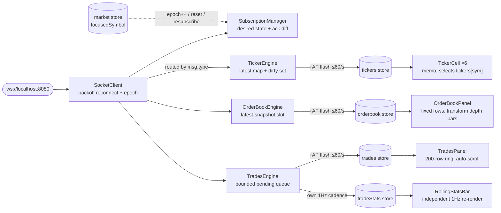

# Architecture

Real-time trading dashboard over the `socket-custom-load` feed (6 symbols,
`v2/ticker` / `l2_orderbook` / `all_trades`). Vite + React 18 + TypeScript
(strict) + Zustand.

## 1. Overview

One direction of data flow, no shortcuts: transport never touches React;
engines never import a store or component; stores never import each other
or the socket. Engines are the *only* writers of market-data stores.



Every engine ingests messages into a cheap holding structure (map+dirty-set,
overwrite slot, bounded queue) and publishes at most once per animation
frame — React never sees wire rate. `l2_orderbook` is a full snapshot, so
dropping an intermediate is lossless; `v2/ticker` is latest-value, same;
`all_trades` is the one stream where every message matters, so it queues and
merges instead of overwriting. Stores publish with only-changed-keys
replacement (`tickers`) or wholesale replacement of an already-derived view,
so `memo`'d components with narrow selectors (`s => s.tickers[symbol]`) skip
re-render by `Object.is` on everything unchanged. An **epoch** counter
(bumped on reconnect and focus switch) is stamped on every message at
arrival and checked at flush; stale-epoch data is dropped. One mechanism
kills both "stale flash after symbol switch" and "ghost data after
reconnect."

## 2. Performance: rAF coalescing, measured

Budget: orderbook flush <5ms, steady 60fps, no unbounded heap growth.
**Measured under evaluation-level stress** (`all_trades` 1–5ms,
`l2_orderbook` 10–20ms → tightened to 1–5ms, `v2/ticker` 10–20ms, via the
backend's `/intervals` API):

- **~925 msg/s absorbed → ~48 flushes/s per engine** (81–88% coalesced by
  rAF batching), steady 60fps — the coalescing thesis, measured.
- **Flush duration <0.1ms**, below the browser's clamped timer resolution
  even at 200+ snapshots/s — reported honestly, not a fabricated p95.
- Drop semantics differ by design: ticker/orderbook drop intermediates
  losslessly; trades never drop except via the 2,000-item pending-queue shed
  under sustained overload.
- Profiler isolation holds under stress: `TickerCell` and `OrderBookRow`
  commit 1–2 memo'd cells per change (`evidence/profiler-ticker-isolation.png`,
  `profiler-book-isolation.png`); a correlated multi-symbol tick still
  batches into one commit (`profiler-ticker-coalescing.png`).
- 10-minute soak: DOM node count and JS heap both flat after the two fixes below.
- Kill/restart mid-stress: badge cycles `reconnecting → connected`,
  subscriptions self-heal via ack diff, no page refresh.

**Two retention bugs found by profiling, fixed:**

1. Heap snapshot: **~70% of heap retained by `PerformanceMeasure`/
   `blink::UserTiming`** — the metrics overlay's `performance.mark`/`measure`
   calls accumulate entries `clearMarks`/`clearMeasures` didn't reliably
   reclaim under load. Fixed with a plain `performance.now()` delta
   (`src/metrics/instrument.ts`) — same duration/resolution, zero entries.
2. Performance Monitor: **DOM nodes climbing to 72k+** under constant-flash
   stress. Cause: the flash overlay mounted a *new* keyed, CSS-animated
   `<div>` per flash (~1,400/s at peak); a detached element with a running
   animation is retained until it finishes. Fixed with **one stable overlay
   per row**, tinted from `row.flash` via a CSS *transition* — zero churn,
   nodes flat at ~6k after.

## 3. Order book grouping: the integer-tick pipeline

One pass, per flush, on the single latest raw snapshot:

```
parse:  ticks = Math.round(parseFloat(priceStr) × 10^precision)
group:  bid = floor(ticks/g)×g | ask = ceil(ticks/g)×g | g = Math.round(increment × 10^precision)
        walk sorted raw arrays once, accumulate size/bucket, running cumulative sum
        EARLY EXIT once N(=12) buckets/side filled
derive: mid, spreadAbs/Bps, imbalance — from the GROUPED view, per spec
```

**Why integer ticks:** float price arithmetic breaks silently at DOGEUSD's
6dp — products like `0.1 × 10^6` don't round-trip exactly in IEEE-754, so a
float-keyed bucket map produces off-by-one-tick, non-deterministic grouping
at the finest rung. Converting to integer ticks up front (`Math.round` on
both the tick conversion and `g`) makes every bucket comparison exact at all
6 precisions — verified in unit tests including a no-drift round-trip at
DOGEUSD 6dp against the real BTC fixture capture.

**Why early exit bounds the work:** raw arrays are sorted best→worst, so the
bucket key is monotonic while walking them — buckets for one price group are
always contiguous, so the pipeline tracks one "current bucket" and stops the
instant N=12 are complete. No full scan of the 500-tuple array, no map; work
is bounded by N, not array length.

## 4. Tradeoffs and tech debt

- **300ms per-bucket flash rate limit.** Backend snapshots are generated
  around a *new random mid* each time, uncorrelated with the last, so an
  unrated ">10% change" rule fires on nearly every bucket, every update. The
  limit is a UX compromise, not a backend-accurate signal.
- **200-row trade ring, no virtualization** — one fewer dependency, fine at
  this size. `TradesPanel` isn't per-row memoized like `OrderBookRow`; the
  whole list re-renders each flush (~2.8ms/200 rows,
  `profiler-trades-isolation.png`). Would need row `memo` or virtualization
  above ~1,000 rows.
- **Pending-queue shed at 2,000.** Under overload beyond one rAF frame's
  drain capacity, `TradesEngine` drops the *oldest* pending trade.
  Documented stress behavior; triggers well above measured peak (~925
  msg/s), queue drains every frame in practice.
- **Spread/mid from the grouped view**, not raw best bid/ask, per spec.
  Spread widens visibly at coarse groupings — correct per spec, not the raw
  top-of-book spread.
- **In-flight-message focus-switch edge (documented, not observed).**
  Engines stamp epoch at message *arrival* and don't filter by symbol; an
  old-symbol message in the sub-ms window between epoch bump and unsubscribe
  could render for one frame. Not observed on localhost; would need
  per-message symbol filtering to close entirely.
- Cosmetic: rolling-stats bar reads 0 for up to ~1s after a switch (window
  resets with epoch) while the feed itself repopulates immediately.

## 5. Scaling to 50 symbols

Breaks in order: **(1) main-thread CPU** — 50 orderbook streams ≈ 50×
parse+group ≈ hundreds of ms/frame → move parse+group to a Web Worker pool,
post transferable grouped arrays back; the engine/store publish interface
doesn't change. **(2) GC pressure** from snapshot churn → pool/reuse
snapshot arrays, publish deltas of the grouped view. **(3) socket parse
cost** — JSON decode itself dominates at that volume → binary protocol.
**(4) DOM** — never mount 50 books; subscribe/render only visible panels,
coarse ~1s cadence for background symbols.

## 6. Documented assumptions

- **Trade side is derived**: `buyer_role === "taker"` → buy, else sell — the
  feed has no `side` field.
- **`ltp_change_24h` is a ratio, not a percent**: `"1.0123"` = +1.23%;
  `changePct = (parseFloat(v) − 1) × 100`.
- **Timestamps are microseconds** (`Date.now() * 1000`), converted to ms
  once at ingest, not per render.
- **Backend trade sizes are near-uniform** (~96–106 observed). Per-symbol
  large-trade thresholds are seeded assuming this range; the mechanism is
  user-editable/persisted, but seeded defaults would need re-tuning if the
  backend's size distribution changed materially.
- **Two-clock rolling-stats ring.** `RollingStats` is advanced by two
  clocks: `record()` buckets each trade by the *backend's* timestamp;
  `tick()` (1Hz eviction off the rAF loop) advances by the *client's*
  `Date.now()`. Both are the same machine here, assumed synchronized; a
  deployed version with real client/server latency would need one clock
  used consistently for both.
